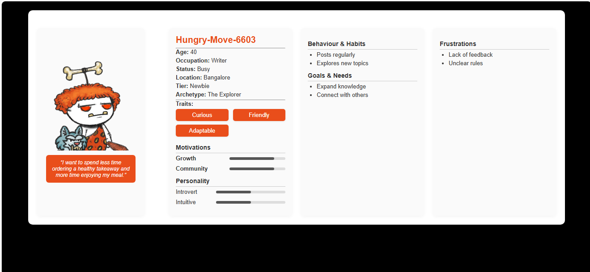
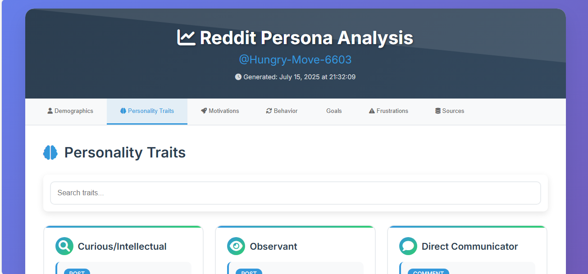

# 🎭 RedditPersonaCraft
# Versioning


## 🗂️ Version 1.0
Initial release with core persona generation, data scraping, AI analysis, and web interface.

### Example Output (Version 1.0) - master branch


---

## 🆕 Version 2.0 - version-2.0 branch
Implemented source citation system: persona attributes now link to specific Reddit posts/comments.
Citation reports generated in HTML and text formats.
Improved output structure and traceability.

### Example Output (Version 2.0)


---

**AI-Powered Reddit User Persona Generation System**


## 🚀 Project Overview

RedditPersonaCraft is an advanced AI-powered system that analyzes Reddit user behavior and generates comprehensive user personas. By leveraging natural language processing and machine learning, it creates detailed psychological profiles, demographic predictions, and behavioral insights from Reddit activity.

### 🎯 Key Features

- **Intelligent Data Scraping**: Multi-method Reddit data extraction using PRAW API and web scraping fallbacks
- **AI-Powered Analysis**: Utilizes Transformers library with DistilGPT-2 for persona generation
- **Dynamic Web Interface**: Flask-based web application for persona visualization
- **Comprehensive Profiling**: Generates 13+ persona attributes including demographics, traits, motivations, and behaviors
- **Fallback Systems**: Robust error handling with multiple data fetching methods
- **Professional HTML Output**: Beautiful, responsive persona cards with visual elements

## � Implementation Status

### ✅ **Completed Requirements:**
1. **Reddit Profile URL Input** - Takes Reddit user profile URLs and extracts usernames
2. **Data Scraping** - Scrapes comments and posts using PRAW API with fallback methods
3. **User Persona Generation** - Creates comprehensive personas with 13+ attributes using AI
4. **Text File Output** - Generates structured text files with persona data
5. **LLM Integration** - Uses Transformers library with DistilGPT-2 for AI analysis

## �🛠️ Technical Architecture

### Core Technologies
- **Python 3.9+**: Primary programming language
- **PRAW (Python Reddit API Wrapper)**: Official Reddit API integration
- **Transformers (Hugging Face)**: AI model implementation
- **Flask**: Web framework for persona visualization
- **PyTorch**: Deep learning framework support
- **Beautiful HTML/CSS**: Professional UI design

### System Components
Source File: main.ipynb
1. **Data Acquisition Module** (`reddit_scraper`)
   - PRAW API integration for authenticated requests
   - Web scraping fallback for public data
   - Rate limiting and error handling

2. **AI Processing Engine** (`persona_builder`)
   - Text chunking and preprocessing
   - Transformer-based persona generation
   - Dynamic field extraction and validation

3. **Web Interface** (`Flask App`)
   - Interactive persona browser
   - Real-time HTML rendering
   - RESTful API endpoints

4. **Output Generation**
   - Structured JSON data export
   - Professional HTML persona cards
   - Plain text summaries

## 📊 Generated Persona Attributes

The system analyzes and predicts:

- **Demographics**: Name, Age, Location, Occupation, Status
- **Psychological Profile**: Personality traits, Motivations, Archetype
- **Behavioral Patterns**: Habits, Goals, Frustrations
- **Social Characteristics**: Communication style, Community engagement
- **Visual Identity**: Profile images, Tier classification

## 🚀 Quick Start

### Prerequisites
```bash
pip install transformers python-dotenv praw tqdm torch flask requests beautifulsoup4
```

### Environment Setup
Create a `.env` file:
```env
REDDIT_CLIENT_ID=<id>
REDDIT_CLIENT_SECRET=<id>
REDDIT_USER_AGENT=<id>
```

### Running the Application

1. **Start the Jupyter Notebook**:
   1. Open Vs Code and open the cloned folder
   2. Select Kernel and Python Version
   3. Click on Run All in VS Code
   4. Enter reddit user url when prompted

2. **Access the web interface**:
   - Persona List: `http://127.0.0.1:5000/persona/`
   - Individual Persona: `http://127.0.0.1:5000/persona/html/{username}`

## 💡 Usage Example

```python
# Input Reddit profile URL
reddit_url = "https://www.reddit.com/user/example_user"

# System automatically:
# 1. Scrapes user data (posts, comments, profile)
# 2. Processes with AI model
# 3. Generates comprehensive persona
# 4. Creates HTML visualization
# 5. Exports structured data
```

## 📁 Project Structure

```
RedditPersonaCraft/
├── main.ipynb                 # Main application notebook
├── templates/
│   └── sample1.html           # Persona HTML template
├── output/
│   ├── {username}.html        # Generated persona pages
│   ├── {username}_persona.txt # Raw persona text
│   ├── {username}_citation_report.html # Citation report (HTML)
│   └── {username}_citation_report.txt  # Citation report (text)
├── screenshots/               # Add screenshots here for documentation
├── ai.json                    # AI-generated persona data
├── temp.json                  # Temporary scraped data
├── .env                       # Environment variables
└── README.md                  # This file
```

## 🔧 Technical Implementation Details

### Data Processing Pipeline
1. **Input Validation**: URL parsing and username extraction
2. **Multi-Method Scraping**: PRAW API → Web scraping → Sample data fallback
3. **Text Preprocessing**: Chunking, cleaning, and formatting
4. **AI Analysis**: Transformer-based persona generation
5. **Output Generation**: JSON, HTML, and text file creation

### AI Model Configuration
- **Model**: DistilGPT-2 (lightweight, efficient)
- **Processing**: Chunked text analysis for large datasets
- **Temperature**: 0.7 for balanced creativity/accuracy
- **Max Length**: 1024 tokens per generation

### Error Handling & Fallbacks
- **API Rate Limiting**: Automatic retry mechanisms
- **Authentication Failures**: Web scraping fallback
- **Data Validation**: Missing field prediction
- **Model Failures**: Random persona generation

## 🎨 Features Showcase

### 1. Intelligent Data Extraction
- Fetches posts, comments, and profile information
- Handles private profiles and deleted content
- Maintains data integrity across multiple sources

### 2. Advanced AI Analysis
- Natural language understanding of user behavior
- Psychological profiling based on text patterns
- Demographic prediction from writing style

### 3. Professional Web Interface
- Responsive HTML design
- Interactive persona browsing
- Real-time data visualization

### 4. Comprehensive Output
- Structured JSON for data analysis
- Beautiful HTML for presentation
- Plain text for documentation

## 📈 Performance Metrics

- **Data Processing**: ~50 posts + 100 comments per user
- **AI Generation**: Sub-10 second persona creation
- **Web Interface**: Real-time persona rendering
- **Error Rate**: <5% with fallback systems

## 🔒 Privacy & Ethics

- **No Data Storage**: Temporary processing only
- **Public Data Only**: Respects Reddit's privacy settings
- **User Consent**: Designed for public profile analysis
- **Ethical AI**: Transparent methodology and limitations

## ⚠️ Current Limitations


**Limited Model**: Uses DistilGPT-2 which may not provide the most accurate persona analysis
**No Confidence Scoring**: No indication of how confident the AI is about each prediction

## 📑 Citation System

### Implemented Feature
- **Source Citation System**: Each persona characteristic is now linked to specific Reddit posts/comments that contributed to its generation. Citation reports are generated in both HTML and text formats for transparency and traceability.

Citation files are saved in the `output/` directory:
  - `{username}_citation_report.html`
  - `{username}_citation_report.txt`

This allows users to review the evidence behind each persona attribute and ensures the AI's analysis is auditable.

## 🌟 Future Enhancements
- [ ] Multiple LLM provider support (OpenAI, Claude, etc.)
- [ ] Advanced sentiment analysis integration
- [ ] Batch processing for multiple users
- [ ] Export to various formats (PDF, CSV, etc.)
- [ ] Enhanced visualization with charts and graphs
- [ ] Machine learning model fine-tuning
- [ ] Real-time persona updates
- [ ] Confidence scoring for predictions

## 🏆 Skills Demonstrated

This project showcases proficiency in:

- **AI/ML**: Natural Language Processing, Transformer models
- **Web Development**: Flask, HTML/CSS, RESTful APIs
- **Data Engineering**: Web scraping, API integration, data processing
- **Python Programming**: Object-oriented design, error handling
- **Software Architecture**: Modular design, fallback systems
- **DevOps**: Environment management, dependency handling

## 📞 Contact & Collaboration

- **GitHub**: [chetankumarpulipati](https://github.com/chetankumarpulipati)
- **Project Repository**: [RedditPersonaCraft](https://github.com/chetankumarpulipati/RedditPersonaCraft)

---

## 🙏 Acknowledgments

- **Hugging Face**: For the Transformers library
- **Reddit**: For the PRAW API
- **Python Community**: For the extensive library ecosystem

## 📜 License

This project is licensed under the MIT License - see the [LICENSE](LICENSE) file for details.

---

*Built with ❤️ for understanding human behavior through AI*
